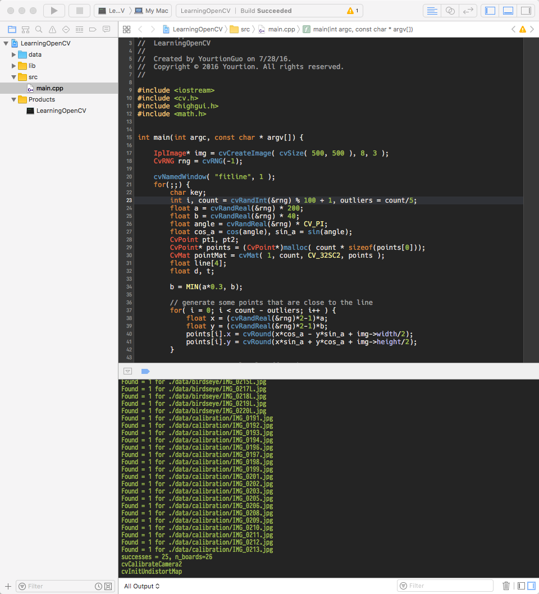

# LearningOpenCV

Source code for Learning OpenCV 

《学习OpenCV》源码，使用 `OpenCV 2.4` 自带 Mac 项目 Xcode 工程。



## 使用方法

### 下载源码

```sh
git clone https://github.com/yourtion/LearningOpenCV.git
```

### 加入OpenCV

 使用 `HomeBrew` 安装：

```sh
$ brew install opencv
```

安装后 `OpenCV` 位于 `/usr/local/Cellar/opencv/2.4.13/lib`，也就是 Xcode 工程中的 `lib` 的位置。

### 使用Demo

所有源码按照章节放在 `src` 目录下，数据位于 `data` 目录。

Checkout 到对应的 commit 即可运行对应的 Demo。

## 源码列表

- [相机数据获取 - CameraCapture](https://github.com/yourtion/LearningOpenCV/blob/master/src/Chapter02/cameraCapture.cpp)
- [图片简单变换 - ImageCannyAndPyrDown](https://github.com/yourtion/LearningOpenCV/blob/master/src/Chapter02/imageCannyAndPyrDown.cpp)
- [加载图片 - LoadImage](https://github.com/yourtion/LearningOpenCV/blob/master/src/Chapter02/load_image.cpp)
- [加载视频文件 - LoadVideo](https://github.com/yourtion/LearningOpenCV/blob/master/src/Chapter02/load_video.cpp)
- [加载视频同时显示进度 - LoadVideoTrackbar](https://github.com/yourtion/LearningOpenCV/blob/master/src/Chapter02/load_videoTrackbar.cpp)
- [图片平滑 - SmoothImage](https://github.com/yourtion/LearningOpenCV/blob/master/src/Chapter02/smoothImage.cpp)
- [视频转换 - VideoConver](https://github.com/yourtion/LearningOpenCV/blob/master/src/Chapter02/videoConver.cpp)
- [半透明 - AlphaBlend](https://github.com/yourtion/LearningOpenCV/blob/master/src/Chapter04/AlphaBlend.cpp)
- [文件存储 - FileStorage](https://github.com/yourtion/LearningOpenCV/blob/master/src/Chapter04/FileStorage.cpp)
- [图片ROI - ImageROI](https://github.com/yourtion/LearningOpenCV/blob/master/src/Chapter04/imageROI.cpp)
- [仿射变换 - AffineTransform](https://github.com/yourtion/LearningOpenCV/blob/master/src/Chapter06/AffineTransform.cpp)
- [透视变换 - PerspectiveTransform](https://github.com/yourtion/LearningOpenCV/blob/master/src/Chapter06/PerspectiveTransform.cpp)
- [查找圆序列 - cvHoughCircles](https://github.com/yourtion/LearningOpenCV/blob/master/src/Chapter06/cvHoughCircles.cpp)
- [绘制盒子 - DrawBoxs](https://github.com/yourtion/LearningOpenCV/blob/master/src/Chapter06/drawBoxs.cpp)
- [直方图EMD计算 - Histogrem-EMD](https://github.com/yourtion/LearningOpenCV/blob/master/src/Chapter07/Histogrem-EMD.cpp)
- [直方图 - Histogrem](https://github.com/yourtion/LearningOpenCV/blob/master/src/Chapter07/Histogrem.cpp)
- [模版匹配 - MatchTemplate](https://github.com/yourtion/LearningOpenCV/blob/master/src/Chapter07/MatchTemplate.cpp)
- [轮廓1 - Contours1](https://github.com/yourtion/LearningOpenCV/blob/master/src/Chapter08/Contours1.cpp)
- [轮廓2 - Contours2](https://github.com/yourtion/LearningOpenCV/blob/master/src/Chapter08/Contours2.cpp)
- [Kalman滤波器 - Kalman](https://github.com/yourtion/LearningOpenCV/blob/master/src/Chapter10/Kalman.cpp)
- [金字塔光流L-K - OpticalFlow](https://github.com/yourtion/LearningOpenCV/blob/master/src/Chapter10/OpticalFlow.cpp)
- [摄像机标定 - Calib](https://github.com/yourtion/LearningOpenCV/blob/master/src/Chapter11/calib.cpp)
- [通过文件标定摄像机 - CalibFromFile](https://github.com/yourtion/LearningOpenCV/blob/master/src/Chapter11/calibFromFile.cpp)
- [直线拟合 - 2DLineFitting](https://github.com/yourtion/LearningOpenCV/blob/master/src/Chapter12/2DLineFitting.cpp)
- [生成鸟瞰图 - BirdsEye](https://github.com/yourtion/LearningOpenCV/blob/master/src/Chapter12/BirdsEye.cpp)
- [立体标定 - StereoCalib](https://github.com/yourtion/LearningOpenCV/blob/master/src/Chapter12/StereoCalib.cpp)
